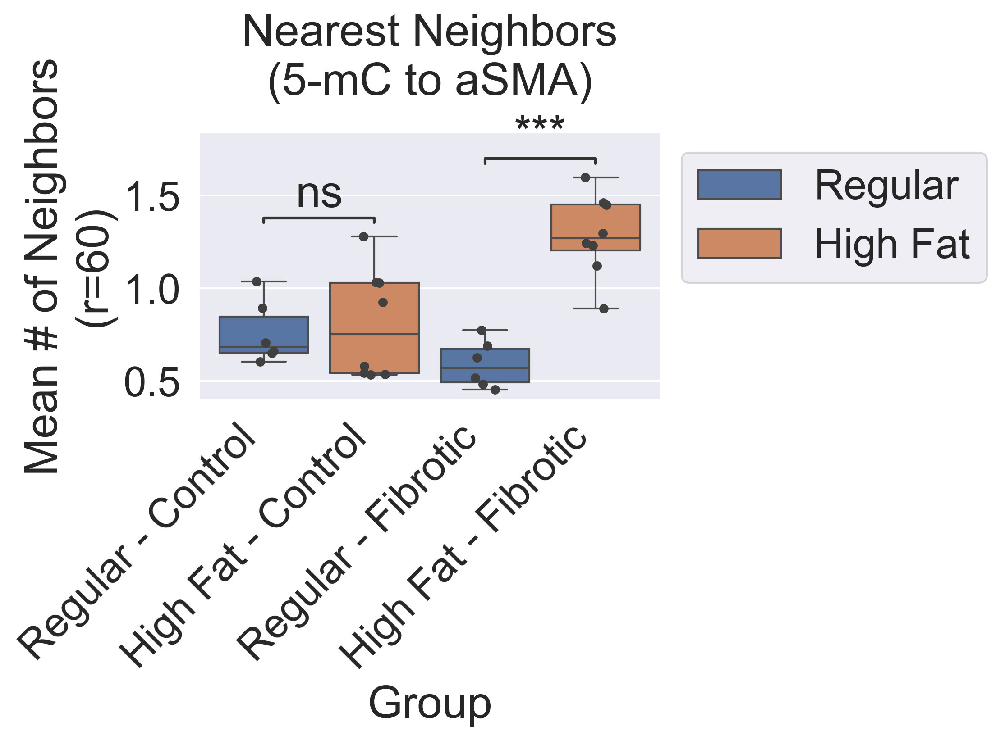
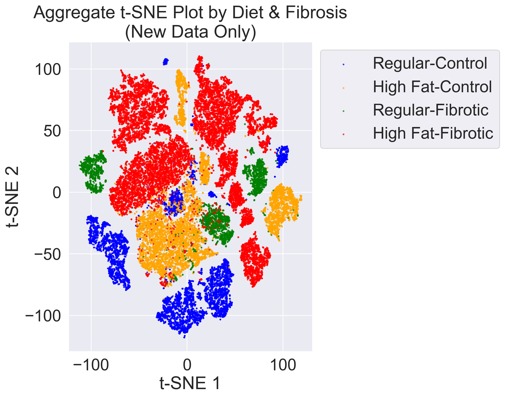
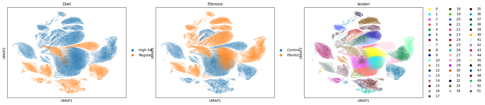
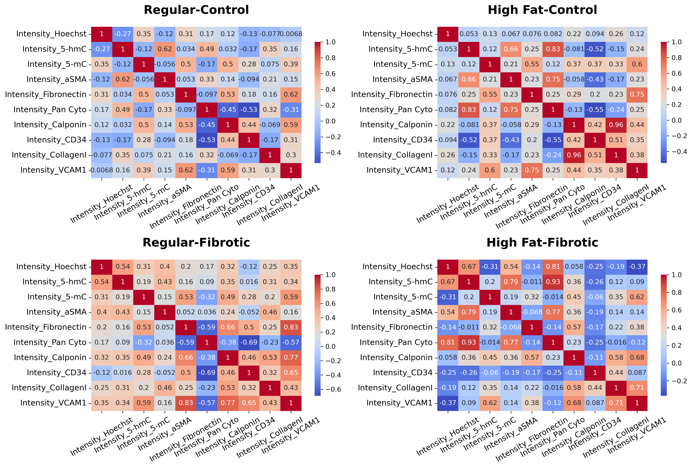
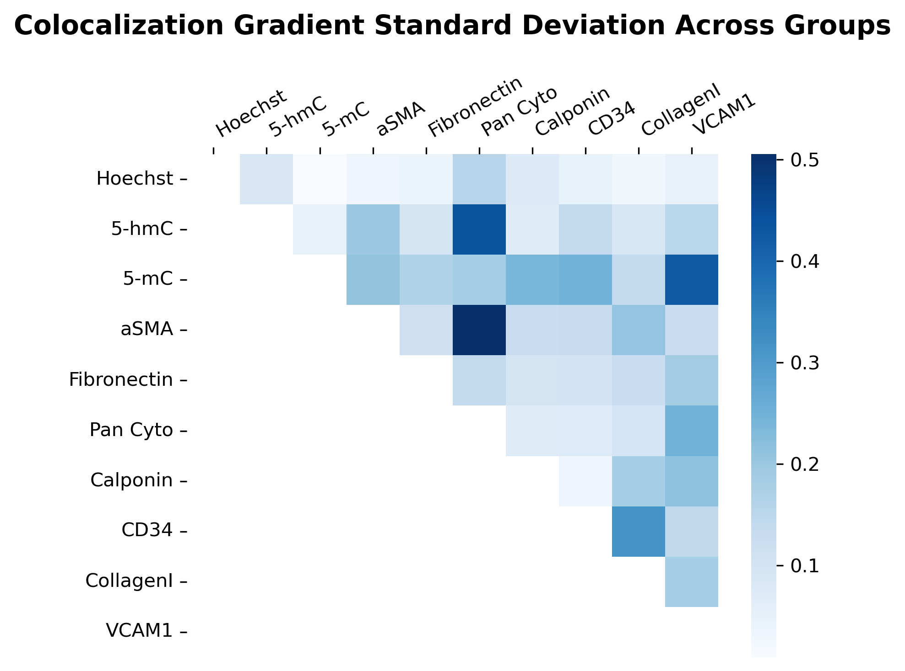
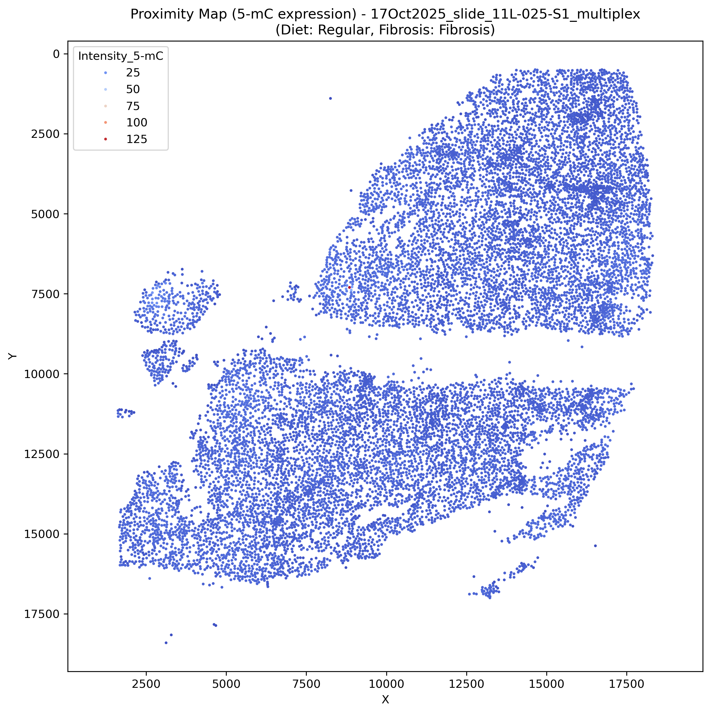

# Liver Fibrosis & Diet Spatial Analysis

This repository contains the computational workflow and Python scripts used for the analysis of liver fibrosis under high-fat diet conditions, as described in the manuscript "Dietary modification of the liver fibrosis spatial proteome".

## Overview

The project investigates the spatial organization of liver tissue markers, specifically focusing on the relationship between DNA methylation (5-mC, 5-hmC) and fibrosis markers (aSMA, Collagen I, etc.) in the context of different diets (Regular vs. High Fat). The analysis involves processing multiplexed immunofluorescence images to perform:

- **Phenotype Clustering**: Identifying cell populations based on marker expression.
- **Spatial Analysis**: Calculating nearest neighbor interactions and proximity maps.
- **Correlation Analysis**: Examining the co-expression of markers.
- **Cell Loss Quantification**: Assessing tissue integrity across imaging cycles.

## Requirements

The analysis relies on the following Python libraries:

- `pandas`
- `numpy`
- `matplotlib`
- `seaborn`
- `scipy`
- `scikit-learn`
- `scanpy`
- `anndata`
- `napari` (for visualization)
- `magicgui`
- `tifffile`
- `cellpose` (for segmentation)
- `statannotations`
- `tqdm`
- `parc` (optional, for clustering)

You can install the required dependencies using the provided `environment.yml` file:

```bash
conda env create -f environment.yml
conda activate <env_name>
```

## Data Structure

The scripts expect a specific data organization:

- **Master Excel File**: `../Data/5Nov2025_all_slides.xlsx` containing metadata for all samples (ExcelPath, Diet, Fibrosis status).
- **Sample Excel Files**: Individual Excel files for each slide defining channels and paths.
- **Stitched Images**: Located in `02 TIF stitched registered` relative to the stitch path.
- **Single Cell Data**: Pickle files (`.pkl`) containing single-cell intensity data, located in `05 PKL single cell`.

> **Note**: The full dataset is 1.5 TB+ and can be requested by email from the authors.

## Scripts Description

The `notebooks` directory contains the core analysis scripts:

### 1. Methylation & Spatial Analysis
- **`22_NNN methylation.py`**: Performs nearest neighbor analysis to quantify spatial relationships between methylation markers (5-mC, 5-hmC) and other cell types. Generates comparative boxplots of neighbor counts.



### 2. Phenotyping & Clustering
- **`23_Phenotype Clustering.py`**: Performs hierarchical clustering, K-Means, and PARC clustering on single-cell data. Visualizes cell populations using t-SNE and heatmaps.



- **`24_Scanorama.py`**: Integrates data from multiple samples and generates UMAP projections to visualize the global cell landscape.



### 3. Correlation & Colocalization
- **`25_Correlation.py`**: Calculates and visualizes the correlation of marker intensities within cells. Produces correlation heatmaps for individual samples and aggregated groups.



- **`27_Colocalization.py`**: detailed colocalization analysis, including gradient standard deviation heatmaps and pairwise scatterplots with trendlines to assess marker co-expression.



### 4. Visualization
- **`26_Proximity map.py`**: An interactive tool using `napari` to visualize bipartite proximity graphs. It draws edges between cells of two different types (e.g., 5-mC positive and Fibronectin positive) that are within a specified radius.



### 5. Quality Control
- **`36_segment_cells__per_cycle_quantify_cell_loss.py`**: Uses Cellpose to segment nuclei in each imaging cycle and quantifies cell loss to ensure data quality and registration accuracy across cycles.


## Usage

1.  Ensure all dependencies are installed.
2.  Verify the `master_excel_path` in the scripts points to the correct location of your metadata file.
3.  Run the scripts from the `notebooks` directory. For example:

```bash
python 22_NNN_methylation.py
```

```bash
python 22_NNN_methylation.py
```

Most scripts will output figures to `../figures`.

## Figures

The `figures` directory contains generated plots corresponding to the scripts, such as:
- Comparative boxplots of nearest neighbors.
- t-SNE and UMAP plots of cell phenotypes.
- Correlation heatmaps.
- Proximity maps and colocalization scatterplots.
